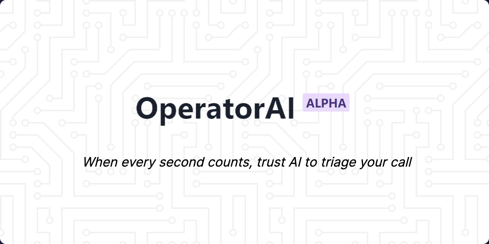

# Operator AI

Operator AI is a real-time emergency call triage dashboard.
It streams live call transcripts, extracts key entities, and helps operators prioritize response faster.

## Architecture

- Frontend: React + Vite + Chakra UI
- Backend: Node.js + Express + WebSocket
- Data store: Firebase Realtime Database
- AI services: Speech transcription + NLP inference

## Project Structure

- frontend: React application for operator dashboard
- backend: call ingestion, transcript processing, and persistence
- assets: project images and diagrams

## Getting Started

### 1. Install dependencies

```bash
cd backend && npm install
cd ../frontend && npm install
```

### 2. Configure environment

Create a `.env` file in `backend/`:

```env
FIREBASE_API_KEY=your_api_key
FIREBASE_AUTH_DOMAIN=your_project.firebaseapp.com
FIREBASE_DATABASE_URL=https://your_project-default-rtdb.firebaseio.com
FIREBASE_PROJECT_ID=your_project_id
FIREBASE_STORAGE_BUCKET=your_project.appspot.com
FIREBASE_MESSAGING_SENDER_ID=your_messaging_sender_id
FIREBASE_APP_ID=your_app_id
```

Create a `.env` file in `frontend/`:

```env
VITE_GOOGLE_API_KEY=your_google_maps_api_key
VITE_FIREBASE_API_KEY=your_api_key
VITE_FIREBASE_AUTH_DOMAIN=your_project.firebaseapp.com
VITE_FIREBASE_DATABASE_URL=https://your_project-default-rtdb.firebaseio.com
VITE_FIREBASE_PROJECT_ID=your_project_id
VITE_FIREBASE_STORAGE_BUCKET=your_project.appspot.com
VITE_FIREBASE_MESSAGING_SENDER_ID=your_messaging_sender_id
VITE_FIREBASE_APP_ID=your_app_id
```

### 3. Run locally

Backend:

```bash
cd backend
npm start
```

Frontend:

```bash
cd frontend
npm run dev
```

## Notes

- This repository intentionally omits private environment values.
- Use your own Firebase project and service credentials.
- Keep `frontend/.env` and `backend/.env` local only.

## Deploy On Railway

Deploy this repo as two Railway services from the same GitHub repository.

If Railway is configured at repository root, this repo includes root deployment files (`railway.toml`, `package.json`, `Procfile`) that run the backend from `backend/`.

### Backend Service

1. In Railway, create a new service from this repo.
2. Recommended: set Root Directory to `backend`.
3. If you keep Root Directory as repo root, Railway will still run backend correctly using root `railway.toml`.
4. Add environment variables:
	- `ASSEMBLYAI_API_KEY`
	- `FIREBASE_API_KEY`
	- `FIREBASE_AUTH_DOMAIN`
	- `FIREBASE_DATABASE_URL`
	- `FIREBASE_PROJECT_ID`
	- `FIREBASE_STORAGE_BUCKET`
	- `FIREBASE_MESSAGING_SENDER_ID`
	- `FIREBASE_APP_ID`
	- `MAPS_API_KEY`
	- `HUGGINGFACE_API_KEY`
	- `HUGGINGFACE_API_KEY2`

Backend uses Railway `PORT` automatically and exposes health check at `/health`.

### Frontend Service

1. Create another Railway service from the same repo.
2. Set Root Directory to `frontend`.
3. Railway will use `frontend/railway.toml` to build and start Vite preview.
4. Add environment variables:
	- `VITE_GOOGLE_API_KEY`
	- `VITE_FIREBASE_API_KEY`
	- `VITE_FIREBASE_AUTH_DOMAIN`
	- `VITE_FIREBASE_DATABASE_URL`
	- `VITE_FIREBASE_PROJECT_ID`
	- `VITE_FIREBASE_STORAGE_BUCKET`
	- `VITE_FIREBASE_MESSAGING_SENDER_ID`
	- `VITE_FIREBASE_APP_ID`

After deployment, set frontend/base API URLs to the backend Railway public URL where required.
